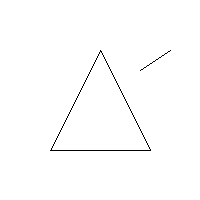
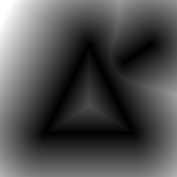

# chaq-sdfgen
chaq-sdfgen is a short program written in C which generates a signed distance field bitmap from an input image.

## Example result

Result generated using `chaq_sdfgen -i sample_input.png -o sample_output.png -s 100 -lan`.

## References
[Original paper](http://cs.brown.edu/people/pfelzens/dt/)

[Implementation chaq-sdfgen is loosely based on](https://github.com/dy/bitmap-sdf)

